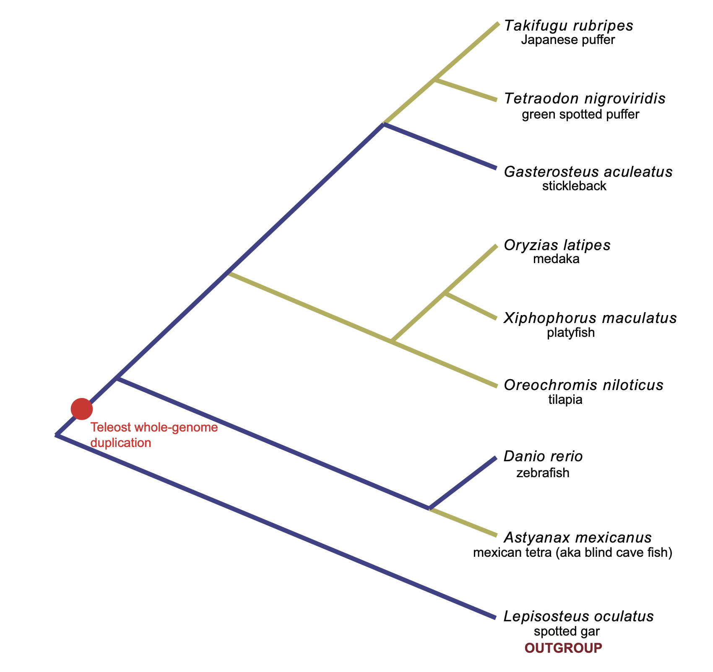

# IGC-fish


## File Structure

```bash
input_files
├── fish                                                               # data for teleost
│   └── Single_Analysis
│       ├── IGC1_Homo                                                 # folder named by dataset and model
│       │   ├── Pillar1050R																		  # Pillar name
│       │   │   ├── Pillar1050R.fasta                               # Alignment file
│       │   │   ├── Run.py                                          # Script that could reproduce the result
│       │   │   ├── save
│       │   │   │   ├── MG94homoOmega__01_02_nonclock_save.npy     # Saved parameters
│       │   │   │   └── MG94homoOmega__01_02_nonclock_save.txt
│       │   │   ├── slurm-423628.out                                # Log file
│       │   │   ├── summary
│       │   │   │   └── MG94_homoOmega_01_02_nonclock_summary.txt  # A summary file that saves all results
│       │   │   └── tree.newick                                     # newick tree file
```

## Result Reproduction

To reproduce the results, you need first to install the `IGCexpansion` software. The installation instruction and tutorial are at: https://github.com/xji3/IGCexpansion.git

After installing the `IGCexpansion` software, you can run the script `Run.py` in each Pillar folder to get the results.

## Tree Topology


