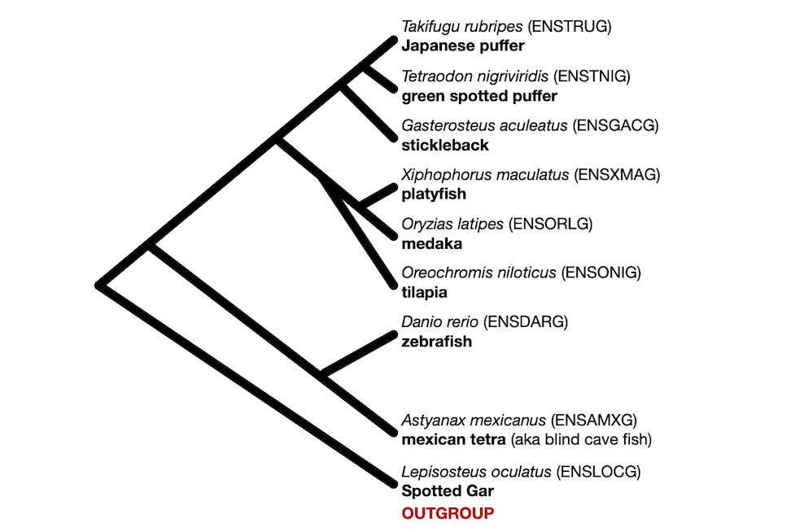

# IGC-fish

`code` folder store the R code

* You will need `Rstudio` software to open ".Rmd" files.

## Tree Topology

## Reference
The summary text files in the `input_files` folder are calculated using the `IGCexpansion` software developed by Dr. Xiang Ji.

You can find the software using this link: https://github.com/xji3/IGCexpansion.git
