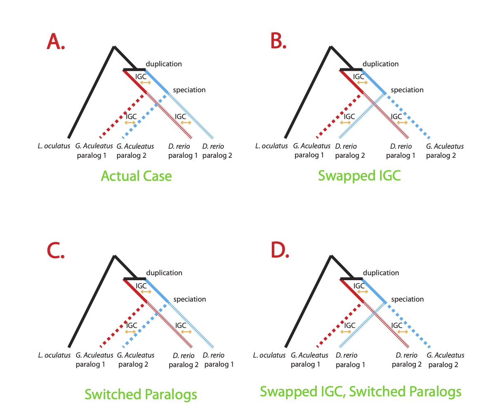

# Folder Name Explanation

An explanation of the name of each folder.

## Dataset

`IGC1`: Fish dataset where all species have 2 paralogs

`IGC2`: Fish dataset where at least one species has 1 or more missing paralogs. (2 paralogs of stickleback and zebrafish DNA and 1 paralog of spotted gar DNA are assured.)

## Models

Here is a list of folder name convention with their model as described in the manuscript.

|Model name in folder | Model in manuscript|
|:---------:|:----------:|
| `Original` | |
| `Homo` | |
| `forceTau` ||
| `forceTau_Homo` | |

## Swap Tests

Swap tests use reduced datasets that only contain two paralogs of DNA sequence from stickleback and zebrafish, and one paralog of DNA sequence from spotted gar as an outgroup. Therefore, there are only five sequences for each dataset in swap tests.

`swap/unswap`: when swapping the data, we swap the sequence between stickleback paralog 2 and zebrafish paralog 2.

`switch/unswitch`: when switching the data, we exchange the sequence between zebrafish paralog 1 and zebrafish paralog2.

*Here's a figure that shows how we change the data:*

